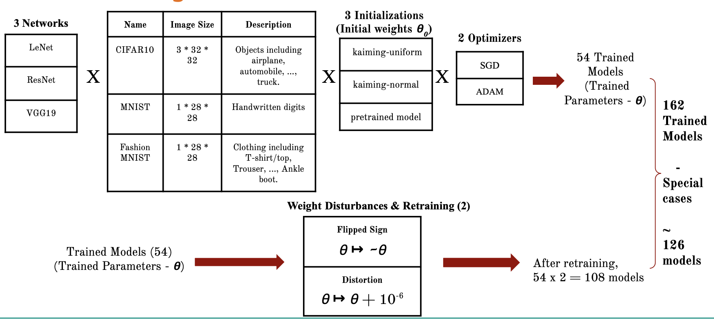
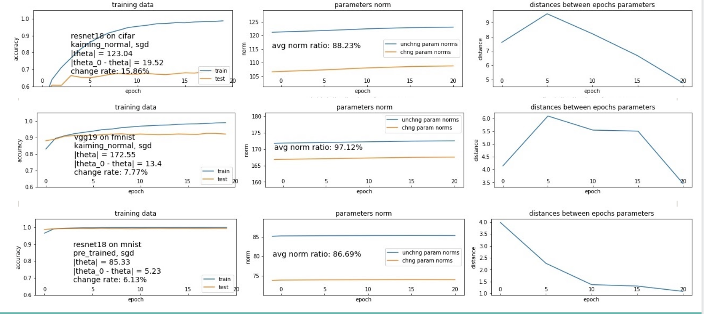
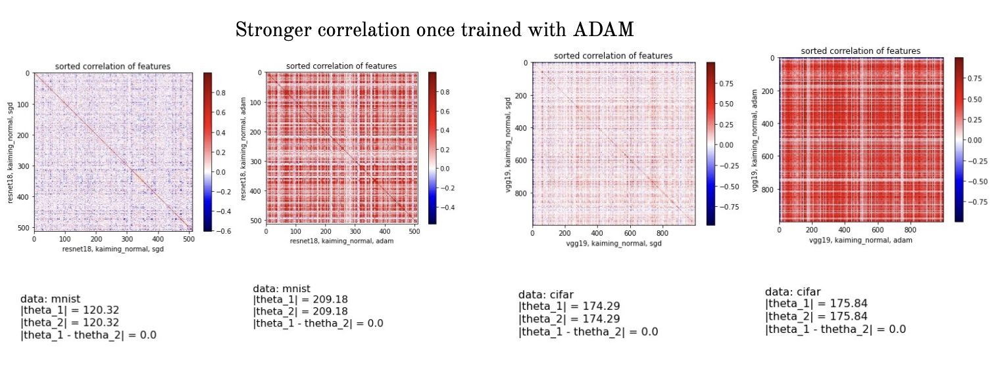
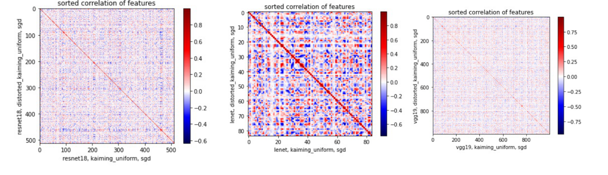
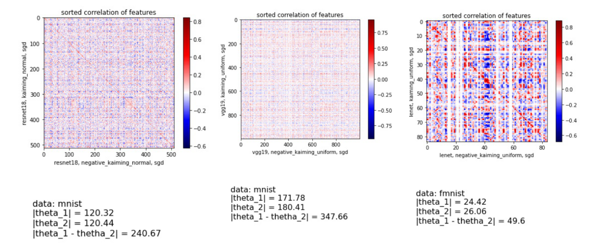

# Analysis-of-Parameter-Dynamics-in-Image-Classification-Models

Recently there have been multiple efforts to debunk the internal mechanics in DNNs by studying the dynamics of parameters and providing the reasons for its successes. In this project, we aim to understand CNNs by developing a tool to understand the evolution of parameters and performances (loss, accuracy) of image classification models during and after training for various initialization techniques. We also plan to study the feature relationships that the networks extracts for performing image classification. It will also be interesting to comment on the convergence of each model. Specifically, we use kaiming-uniform and kaiming-normal initializations to study the convergence points for each model. Moreover, we also apply the same methods on the pre-trained models and perturb each of the trained model parameters to initialize a new model and train it. With this approach, we end up having multiple local minimas for each model which gives us enough materials to study the convergence of all the models.

Overall in this project we try to run different experiments to answer the following questions 
- What percentage of the initialized parameters change after the training? Shallow (LeNet) vs deep networks (VGG, ResNet) - do they have different characteristics in this context? Does the weight initializer play a role in this case? 
- How distant (norm) are the trained parameters from initialized parameters? Does the learning optimizer affect this characteristic? 
- If we take a pretrained model and flip the sign of its weights, does the model again converge back to the same weights? 
- If we take a trained model and add a small distortion to the weights, does the model converge back to the same weights? 
- Are learnt features independent of each other or is there any correlation?  Does choice of optimizer have any impact on it? 

### Approach
We trained LeNet, Resnet18, and VGG Networks (well established image classification models) under various initialization settings (weight initializations, optimizers etc.) to classify images given by three datasets, namely Cifar10, Fashion MNIST, and MNIST. Once models are trained, the relation between extracted features from different models was then studied using statistical methods such as correlation. Moreover, we also computed the evolution of parameters and performances of such networks during and after training.

Please refer to our slides for more information:  

### A description of the repository & commands to execute

This repository contains the documented notebook files which was used to train the LeNet, ResNet and VGG models (in total 126 models were trained) with different initialization techniques implemented in Pytorch.  

### Results and observations  

1. Resnet tends to keep over 60% parameters unchanged regardless of dataset, optimizer, initial point whereas LeNet and VGG had >90% parameters changed. We think it is due to lazy training phenomenon. 
![resnet_viz] (files/resnet_result.png)
![lenet_vgg] (files/lenet_vgg.png)

2. SGD finds a close local minima for huge networks.

3. We observed that when we train a same model with SGD and ADAM, we saw a very strong correlation between features trained with ADAM. 

4. Coming to the distortion effect, it seems that distortion has very minimal effect on the training process. They more or less converge to the same features even with weight distortions. Here, we are looking at plot between models features and it’s features trained with model distortions. Also, when we compared the norm between the parameters of both the models after training, they were very close suggesting that it has minimal effects.

5. Whereas, when we flipped the weights and retrained the models, we observed that it forced the local minima to be very far from the initial point. This was obvious when we compared the norm distances between the original model and it’s flipped weights model. 

 

